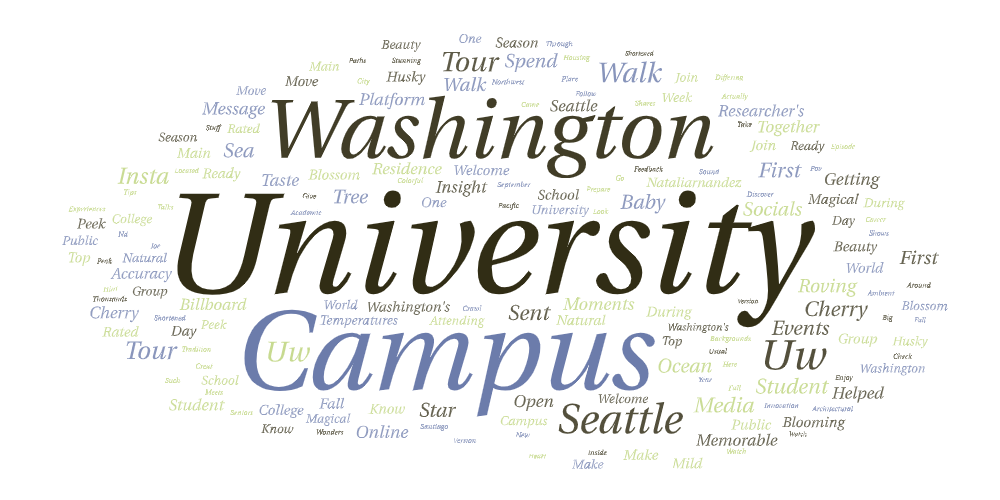
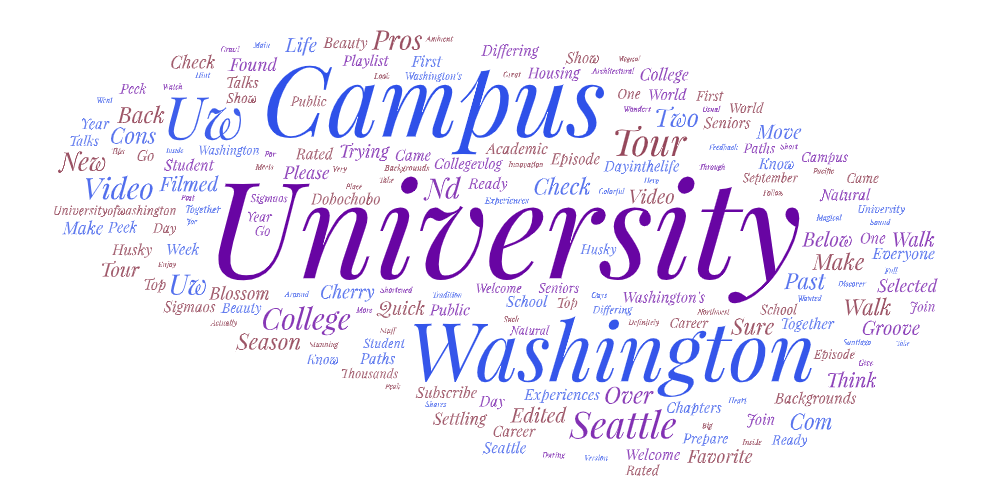
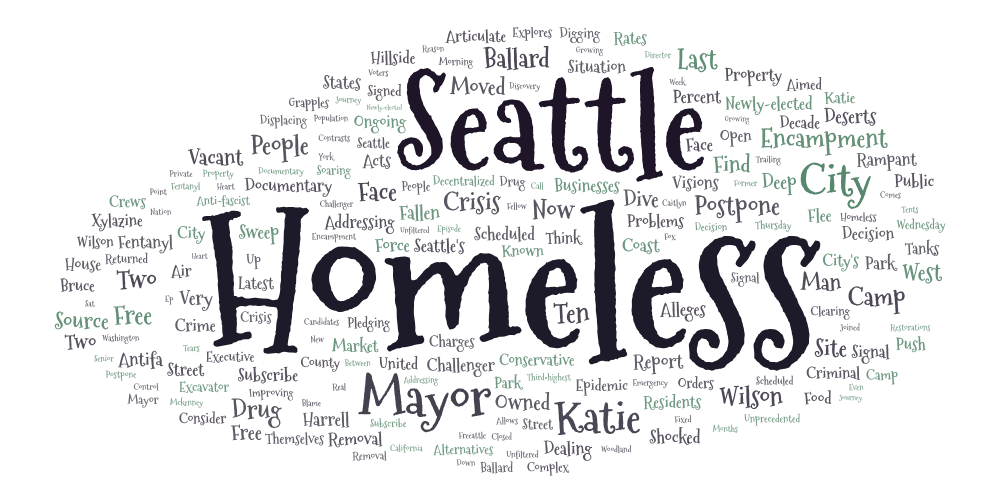

# Lab 2: Web Data Collection and Visualization

**Course:** GEOG 458  
**Instructor:** Bo Zhao  
**Student:** Malika Ali

---

## 1. Research Topic and Search Parameters

The goal of this lab is to explore how YouTube users discuss topics related to the University of Washington and the social issue of homelessness in Seattle by collecting and analyzing video metadata using a web crawler. To capture variations in how the same topic is referenced, I ran the YouTube crawler using the following three search terms:

* **"university of washington"**
* **"univ of washington"**
* **"seattle homelessness"**

Each search term was executed separately using the same crawler logic to ensure consistency across datasets. The crawler collected video metadata including video URLs, channel information, titles, short descriptions, view counts, upload times, and collection timestamps. The resulting datasets were exported as CSV files and stored in the repository.

---

## 2. Motivation for the Comparison

The motivation behind using multiple search terms is that users often refer to the same institution in different ways, or discuss a social topic in different contexts. A single keyword search may fail to capture the full range of discourse. By comparing results from formal, semi-formal, and geographically-focused search terms, this analysis aims to understand whether different keywords lead to variations in thematic emphasis, video types, or audience focus.

---

## 3. Word Cloud Comparison and Analysis

To analyze the content of the collected videos, word clouds were generated using the `shortdesc` field from each dataset. These word clouds visualize the most frequently occurring terms and provide a high-level summary of discussion themes.

### Word Cloud: "university of washington"

### Word Cloud: "univ of washington"

### Word Cloud: "seattle homelessness"

**Comparison:**  
The word clouds for **"university of washington"** and **"univ of washington"** show differences in formality: the full name emphasizes academic and institutional terms, while the abbreviated version highlights informal, student-oriented content. The **"seattle homelessness"** word cloud reveals a distinct vocabulary focused on social issues, community events, and news coverage, contrasting with the university-related searches.

---

## 4. Possible Explanations for Observed Patterns

The observed differences likely stem from:

* Audience and context: abbreviated or informal terms capture student and community content, while formal terms capture official, academic, or institutional content.
* Algorithmic differences in YouTube search results depending on keyword specificity.
* Topic relevance: social issues generate different descriptive language compared to institutional content.

---

## 5. Limitations and Future Improvements

**Limitations:**

* The datasets represent snapshots in time and do not reflect temporal trends.
* The crawler collected a limited number of videos per search term.
* Word clouds capture frequency, but not sentiment or context.

**Future improvements:**

* Increase the number of scrolls to gather more data.
* Run the crawler at multiple time points to analyze trends.
* Apply natural language processing for topic modeling or sentiment analysis.
* Incorporate geographic filtering or channel-level analysis for richer insights.

---

## 6. Unexpected Observations

One unexpected observation was that informal and abbreviated search terms surfaced widely shared and highly viewed content, whereas formal terms tended to return institutional or news-oriented videos. This highlights the importance of carefully selecting keywords to fully capture online discourse.

---

## 7. Data Access

The collected datasets can be downloaded from the links below:

* [university_of_washington.csv](assets/university_of_washington.csv)  
* [univ_of_washington.csv](assets/univ_of_washington.csv)  
* [seattle_homelessness.csv](assets/seattle_homelessness.csv)  

---

## 8. Conclusion

This lab demonstrates how web crawlers can collect and visualize YouTube data, and how keyword choice influences analytical outcomes. By comparing formal, semi-formal, and socially-focused search terms, meaningful differences in video content and themes were revealed. The results highlight the importance of methodological choices in web data research and provide a foundation for more advanced spatial, social, or thematic analyses in future work.
